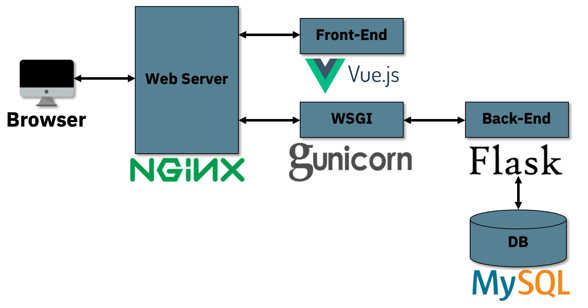

# kyobobook-review

## frontend

[frontend README.md로 이동](frontend/README.md)

## backend

[backend README.md로 이동](backend/README.md)

## docker

팀 프로젝트로 팀원 및 서버와 개발 환경을 쉽게 동기화하기 위해 [Docker](https://www.docker.com/)를 사용했다.

`kyobobook-review`가 있는 폴더로 진입 후

```
docker-compose up
```

`frontend:80`, `backend:7000`이 실행된다.

## 폴더 구조

```
├── backend/
│   ├── ...
│   ├── app.py
│   ├── wsgi.py
│   ├── Dockerfile
│   └── README.md
├── frontend/
│   ├── ...
│   ├── src/
│   │   ├── components/
│   │   └── App.vue
│   ├── api.js nginx.conf
│   ├── nginx.conf
│   ├── Dockerfile
│   └── README.md
├── Code/
│   ├── Analysis/
│   ├── Classification/
│   ├── Crawling/
│   └── README.md
├── Data/
│   ├── 리뷰순/
│   ├── 모델/
│   │   ├── 분류기/
│   │   │   └── checkpoint-doccls/
│   │   └── 생성기/
│   │   │   └── checkpoint-generation/
│   ├── 분야별/
│   └── Top3/
├── docker-compose.yml
├── Pipfile
└── README.md
```

## Data

[Selenium4](https://www.selenium.dev/)를 활용하여 [교보문고](http://www.kyobobook.co.kr/index.laf)의 2022년 8월 1일부터 2022년 8월 31일까지의 종합 월간 베스트의 각 분야별 책에 대한 리뷰데이터를 구했다.

---

용량 문제로 인해 최소 기능 동작을 위해 리뷰가 가장 많은 책 Top3를 선정했다.

1. 나미야 잡화점의 기적 - 소설
2. 코스모스 - 과학
3. 사피엔스 - 인문

교보문고 + 교보ebook + yes24의 데이터를 크롤링했다.

|     | 나미야 잡화점의 기적 | 코스모스 | 사피엔스 |
| --- | -------------------- | -------- | -------- |
| row | 3610                 | 1898     | 2137     |

## 크롤링 방법

[Crawling README.md로 이동](Code/README.md)

## pipenv 설치

```
pip3 install pipenv
또는
pip install pipenv
```

pipenv 가상환경 패키지 설치

```
pipenv install
```

## ToDo

데이터 관련 크롤링

- [x] 리뷰 크롤링
- [x] 한 페이지 크롤링
- [x] 페이지 넘어가는 것
- [x] 각 분야의 상위20 책 리뷰 데이터 가져오기
- [x] **데이터 용량 문제를 대비하여 최대 60페이지 리뷰만 가져옴**
- [x] 데이터 크롤링 완료

모델 학습

- [x] 데이터 y columns으로 긍정:1, 부정:0 나누기
- [x] 모델 학습을 위한 columns명 및 확장자 변경
- [x] 도서 분류 모델
- [x] 도서 분류 모델 학습률 높이기
- [x] 리뷰 문장 생성 모델

frontend, backend

- [x] 목업 화면 생성
- [x] 문장 생성기 API 통신
- [x] 문장 분류기 API 통신
- [x] css 꾸미기
- [x] 문장 생성기 파라미터 값 조정
- [x] 생각 검색 후 책 분야 및 책 추천
- [x] 책 이름 클릭 시 해당 워드 클라우드 생성

발표

- [x] 발표 흐름 구성
- [x] PPT 자료 만들기

목표

- [x] 10월 10일(월), 11일(화) 발표자료와 웹 완성하기
- [x] 10월 12일(수) 멘토님께 전체적인 피드백 받기
- [x] 10월 13일(목) 피드백 받은 것 개선 하기
- [x] 10월 14일(금) 발표

## 서비스 아키텍처


